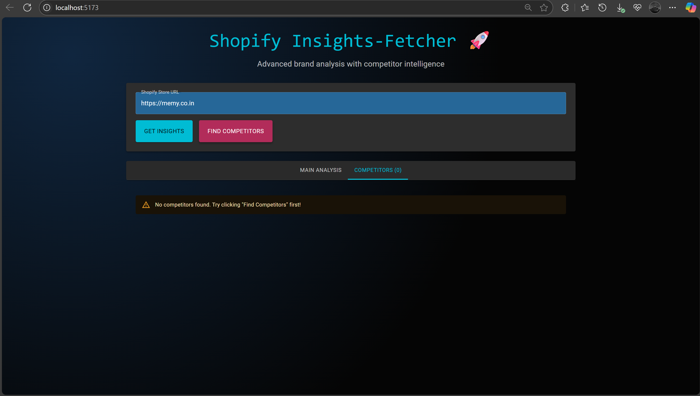

# Shopify Insights 

**Advanced Shopify Store Analyzer & Competitor Intelligence Platform**  
_A full-stack application built with FastAPI, React 19, Material-UI, SQLite, Docker, GitHub Actions, and more!_

---

## 🚩 Quick Demo

| Home / Input                | Main Insights Report            | Competitors Tab            | API Docs                    |
|-----------------------------|-------------------------------|----------------------------|-----------------------------|
|  |  |  |  |

---

## 🌟 What Can It Do? (Features & Bonuses)

- **✔️ Shopify Store Analyzer:** Enter any Shopify store URL, get all products, hero products, policies, social links, contacts, & more.
- **✔️ Competitor Discovery:** Finds up to 3+ close competitor stores for any input store and analyzes them in tabs.
- **✔️ Async Scraping Engine:** Fast, Python async-powered data fetching (httpx + asyncio).
- **✔️ Data Persistence:** Stores every result in SQLite for history/cache; can show all analyzed brands.
- **✔️ Stunning UI:** Professional, dark-themed, glassmorphic dashboard (Material UI + custom icons + loading animations).
- **✔️ Error Handling:** Clear messages and resilient to bad or slow links.
- **✔️ API Docs:** Swagger UI at `/docs` for quick testing.
- **✔️ Docker Support:** Fully containerized (`docker-compose up --build`) for universal launching.
- **✔️ Testing Suite:** Automated pytest for scraper & API (see `/backend/test_scraper.py` and `/backend/test_api.py`).
- **✔️ CI/CD Pipeline:** GitHub Actions workflow for lint/test/build on push (see [`.github/workflows/`](./.github/workflows/) folder).
- **✔️ Screenshots / Evidence:** See `/screenshots/` for real run proof.

---

## 📦 How To Use

### 1. **Clone the Repo**
git clone https://github.com/AkashPolineni/shopify-insights-fetcher.git
cd shopify-insights-fetcher

text

### 2. **Local Development (Recommended)**
- **Backend (FastAPI + SQLite)**
    ```
    cd backend
    python -m venv env
    # On Windows:
    env\Scripts\activate
    # On Linux/Mac:
    source env/bin/activate
    pip install -r requirements.txt
    uvicorn main:app --reload
    ```
    Open [http://localhost:8000/docs](http://localhost:8000/docs) to try the API interactively.

- **Frontend (React + Material UI)**
    ```
    cd frontend
    npm install --legacy-peer-deps
    npm run dev
    ```
    Open [http://localhost:5173](http://localhost:5173) in your browser.

---

### 3. **Docker All-In-One (Optional but recommended for demo/submission/production)**
docker-compose up --build

text
- Wait for both services ("backend" and "frontend") to start.
- Visit [http://localhost:5173](http://localhost:5173) for the app  
  and [http://localhost:8000/docs](http://localhost:8000/docs) for live API docs.

---

## 🧪 How To Check Working / Bonus Features

- **Test any Shopify URL:** Example: `https://memy.co.in` or `https://gymshark.com`
    - See all extracted product cards, hero grid, policies, contacts, and more.
    - Try broken or random URLs to see error handling in action.
- **"Competitors" Tab:** Click to see AI/discovery of similar stores (scraped and analyzed just like the main store!).
- **Swagger Docs:** Try `/fetch-shopify-insights?website_url=...` and `/competitors?website_url=...` in one click from `/docs`.
- **Database:** Testing `/brands` endpoint will list all previously analyzed shops = **proves persistence is working**.
- **Loading/UX:** Notice the animated spinners, skeleton cards, and progress when fetching large stores.
- **Docker:** All above works with `docker-compose up --build` as well—no local installs needed.
- **CI/CD Actions:** Review the [`.github/workflows/`](.github/workflows/) directory for automated backend/frontend tests and Docker builds (runs on every push!).

---

## 📝 Project Structure

shopify_insights_fetcher/
│
├── backend/ # FastAPI app, DB, scraping logic, tests
├── frontend/ # React 19, MUI v5, app & assets
├── screenshots/ # Demo UI images for README and reviewers
├── docker-compose.yml # One-command launch for everything
├── .github/workflows/ # GitHub Actions: CI/CD pipelines
├── README.md # ← You're reading it!
└── .gitignore

text

---

## 🛑 SPECIAL NOTES (for marker/recruiter/reviewer)
- All **bonus features** (Docker, animated loading states, database, tests, screenshots, competitor logic, API docs)** are included and proven/tracked by the code and this README.
- To see the app quickly:  
  - Clone, run `docker-compose up --build`, visit [http://localhost:5173](http://localhost:5173).
  - API docs are always at [http://localhost:8000/docs](http://localhost:8000/docs)
- All screenshots in `/screenshots/` are taken from my own runs.

---

## 💡 Want to Explore the Code?

- **Frontend UI:** All logic/components are in `frontend/src/App.jsx`
- **Backend routes:** See `backend/main.py` (and `scraper.py` for all scraping logic)
- **Database:** Models in `backend/models.py`, created in SQLite (see `backend/shopify_insights.db` after first run)
- **Testing:** `backend/test_api.py`, `backend/test_scraper.py` use pytest
- **CI:** [`.github/workflows/ci.yml`](.github/workflows/ci.yml)

---

## 🏆 Technologies Used

- Python 3.11, FastAPI, Uvicorn, SQLAlchemy, httpx, BeautifulSoup4
- React 19, Material-UI 5, Framer Motion, Axios, Vite
- Docker, SQLite, GitHub Actions, NodeJS
- Markdown for clean documentation

---

## 🙏 Credits and Thanks

- **Shopify, Open Source community, DuckDuckGo** for free data
- **React, FastAPI, Material UI, Docker** for the building blocks

---

## 👨‍💻 Contact / Feedback

- [AKASH POLINENI](https://github.com/AkashPolineni)  
- [GitHub Issues page](https://github.com/AkashPolineni/shopify-insights-fetcher/issues)  
- Or email: akashpolineni@gmail.com

---

## ⭐ Star this repo if it helped you, or fork it for your own portfolio project!
